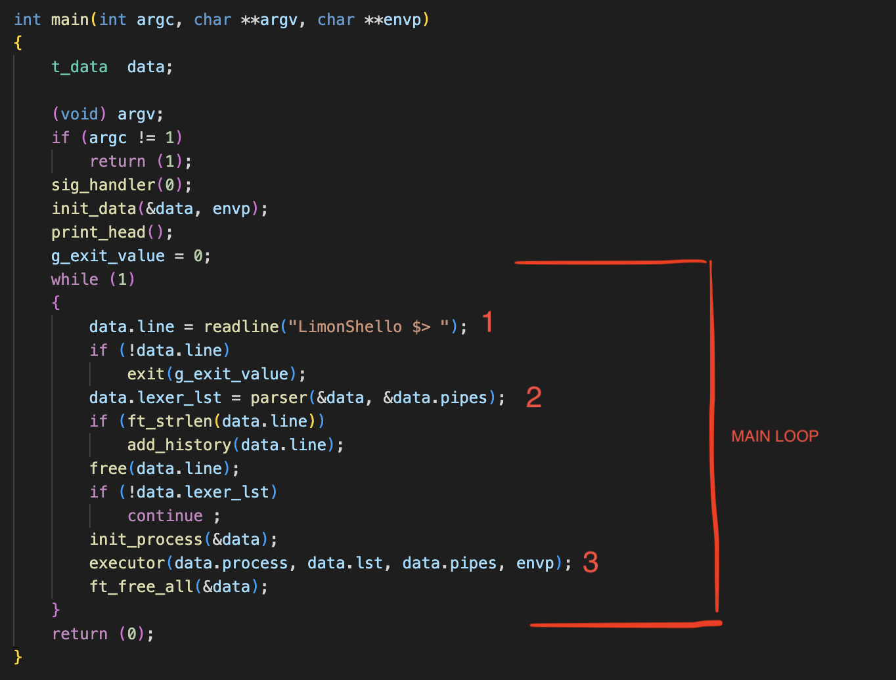
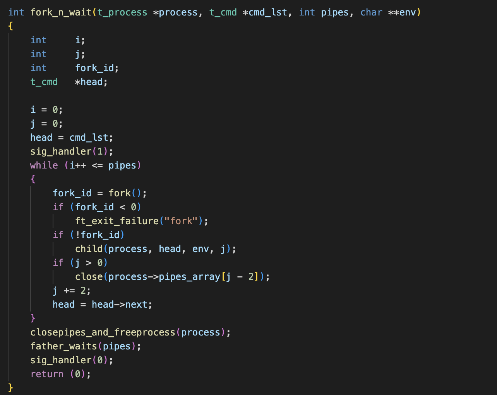
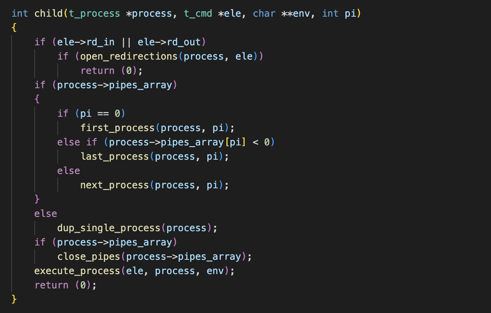

# LIMONSHELLO

:construction_worker_man: README en travaux ! :construction_worker_woman:

Une version simplifiée de Bash


## Principe
### Qu'est-ce qu'un shell ?

Un shell, ou interpréteur de commande, permet comme son nom l'indique la traduction de commandes saisies par un utilisateur à destination d'un système d'exploitation. Pour ce projet, nous essaierons de reproduire le comportement de bash, le shell Unix par défaut.
Le shell permet à l'utilisateur de lancer des programmes, effectuer des opérations de manipulation de fichiers, accéder aux répertoires et permet également d'afficher les résultats des commandes et d'interagir avec eux.

### Fonctionnalités

Notre version de Bash ne cherchera pas à reproduire la totalité des features du shell; les opérateurs **&&** et **||**, les wildcards ou symboles spéciaux à interpréter ne seront pas pris en compte.
Néanmoins, voici une liste des fonctionnalités que nous allons pouvoir gérer :

- Afficher un prompt en attente d'une nouvelle commande. Aucune erreur ne devrait quitter notre programme. 
- Trouver et executer les commandes transmises par l'utilisateur.
- Implémenter les pipes `|`.
- Gérer les redirections telles que :
  - `<` Input.
  - `<<` Heredoc.
  - `>` Output en mode simple.
  - `>>` Output en mode *append*.
- Gérer les quotes simples et doubles. On renverra une erreur si une quote n'est pas fermée.
- Gérer les variables d'environnement ainsi que `$?`.
- `ctrl-C`, `ctrl-D`, et `ctrl-\` doivent réagir exactement comme dans Bash.
- Implémenter les built-ins suivants:
  - `echo` avec l'option `-n`.
  - `cd` suivi d'un chemin relatif ou absolu.
  - `pwd`
  - `export`
  - `unset`
  - `env`
  - `exit`
- Avoir un historique fonctionnel.
- Avoir une solide gestion des erreurs potentiellement transmises par l'utilisateur. Donc pas de crash/segfault/leak d'aucun genre.

### Achitecture générale

Notre programme se base sur une loop principale qui tourne indéfiniment et réalise 3 grandes actions.

1 - Tout d'abord, avec la fonction **readline()** un prompt est affiché pour que l'utilisateur puisse entrer sa ligne de commande.
*A noter que readline() renvoie une string qui a été allouée dynamiquement.*

2 - Il faut ensuite pouvoir délivrer à l'executeur des blocs d'instructions dans un format unique que nous définissons lors du parsing.
En suivant le fonctionnement interne de Bash, deux parties se dégagent : Le **lexer** et le **parser**.

3 - Enfin, on doit envoyer nos blocs d'instructions à l'**executor**. C'est une loop de processus enfants qui executent chacun un bloc d'instruction.
Quand cette fonction se termine, on revient à notre loop principale et le prompt est à nouveau renvoyé en attendant la prochaine commande utilisateur.



> ***srcs/minishell.c***

## Parsing
### LEXER
Le rôle du lexer est tout simplement de séparer chaque "mot" les uns des autres. Un mot est défini comme une suite de caractères autres que séparateurs (espaces, tabulations...). Cependant, une string définie par des doubles ou simples guillements compte comme un seul mot, guillemets inclus. C'est donc à ce moment qu'on vérifiera que chaque quote est bien fermée.
Avant cela, fera un premier check de la place des pipes **"|"** et redirections **"<" ">" "<<" ">>"**, que plusieurs ne se suivent pas ou ne commencent/termine pas notre ligne de commande. Il faut penser à tous les cas de figure possibles.

On va donc récupérer chaque mots et les ajouter dans une liste chaînée.


Chaque élément de notre liste chaînée comporte donc un pointeur vers une string que nous avons alloué dynamiquement avec **malloc()**. La difficulté aura été ici de trouver la taille de chaque malloc, spécialement dans le cas de nos quotes.

### PARSER

Une fois notre liste chaînée délivrée par le lexer, il va falloir la convertir en une seconde liste chaînée propre au parser, où chaque élément contiendra une instruction à envoyer à l'executeur par après.
Pour faire simple, nous séparons notre liste lexer à chaque pipe **|** et classons chaque élément à l'interieur d'un groupe selon 3 catégories :
- La commande suivie de ses arguments. Sous forme de double pointeur char, la commande sera toujours  l'index 0.
- L'option builtin (à *NULL* par défaut) est un pointeur sur fonction. En plus de remplir le **char, si un de nos built-in est reconnu cette option permettra d'envoyer les arguments à l'une de nos fonctions.
- L'option redirection (à *NULL* par défaut). Cette string est composée du token de redirection, un espace et le nom de fichier spécifié.


> ***Illustration trouvée sur le github de [Maia de Graaf](https://github.com/maiadegraaf)***


> ***On trouve aussi un pointeur sur la liste chaînée contenant les variables d'environnement***


Après avoir malloc chaque nouvel élément de notre liste, nous entrons dans une boucle de tri jusqu'à rencontrer un pipe **|** ou la fin de notre première liste.
Ainsi, tant qu'un token de redirection n'est pas rencontré, nous récuperons chaque mot et le stockons dans le **char. Nous ne regardons pas si les commandes ou arguments sont valides, ce sera à la partie d'execution de le faire.


> ***srcs/parser/parser.c***


Quand aux redirections, plusieurs problèmes se sont posés ici. En effet, et pour correspondre au comportement de bash, si l'utilisateur a entré plusieurs redirections en entrée comme en sortie, il faut:
- tester chaque input et renvoyer une erreur si un fichier n'existe pas ou si l'utilisateur n'a pas les droits
- tester chaque output, les créer si inexistants.

On aura donc une fonction qui testera d'ouvrir le file descriptor actuel si on cherche à lui attribuer une nouvelle string.
Ainsi, l'executor se retrouvera soit avec la dernière redirection du bloc, soit avec la dernière qui a posé une erreur. Ce sera à l'executor de réouvrir la redirection qu'on lui a envoyé, et de renvoyer une erreur s'il y en a une. En attendant, on aura testé chaque FD et crée les fichiers dans le cas des outputs:


> ***srcs/parser/redirections.c***


### EXPANDER
A la fin de notre Parsing, nous envoyons les éléments de notre liste vers notre Expander. Le rôle de l'expander est de remplacer chaque variable d'environnement par sa valeur.
Par exemple la commande suivante devrait afficher votre nom d'utilisateur.
```bash
$> echo $USER
```
Cependant nous avons fait le choix d'octroyer à cette fonction la mission de supprimer les quotes, puisque ces deux actions sont étroitement liées. En effet, selon si les quotes sont doubles ou simples, les variables d'environnement ne seront pas interprétées.
On oubliera pas non plus la capacité de récupérer le dernier code d'erreur renvoyé par notre boucle :
```bash
$> echo $?
```

Aussi, si le pointeur builtin est different de NULL, alors nous n'enverrons pas nos commandes à l'expander. En effet dans certains cas certaines fonctionnalités comme **export** auront besoin des quotes. L'appel à l'expander se fera donc dans les built-ins mêmes.


## Executor

Pour une définition des processus Unix, des commandes **fork()**, **execve()** et **dup2()** ainsi que toute la documentation relative, voir mon projet [pipex](https://github.com/ArnoChansarel/pipex). Tout l'executor est majoritairement basé sur ce projet.

Première particularité cependant, on commence par regarder le nombre de commandes entrées par l'utilisateur (càd nobre de pipes). Car en effet dans Bash les commandes builtins ne sont pas executées dans un processus forké si la ligne de commande ne comporte pas de pipes. POur arriver au même résultat il faut donc faire un premier check dès qu'on entre dans notre executor.

On lance notre boucle qui va créer les processus child via la fonction **fork()**, puis laisser le processus parent les attendre via **father_waits()**. Le jeu va être de bien gérer les copies de file descriptor via **dup2()**, car beaucoup de paramètres rentrent en compte. Si pipe il y a, si redirections il y a, etc... 



> ***srcs/executor/executor.c***

C'est donc dans notre fonction **child()** qu'on ouvrira la dernière redirection récupérée dans le parser et qu'on renverra une erreur si besoin. Ensuite chaque fonction notée **n_process()** a pour but les copies de file descriptor. Enfin, la fonction **execute_process()** se déroule comme suit : 
- Retrouver notre executable de commande via la variable d'environement "PATH"
- La vérifier avec la fonction **access()**
- Transformer notre liste chaînée de variable d'environement en un tableau de string pour l'envoyer à **execve()**
- Appeler **execve()** qui terminera le processus une fois la commande executée



> ***srcs/executor/executor.c***

## Built-ins

| Command | Description |
|---|---|
|`cd`| Change de répertoire courant, et update les variable `PWD` et `OLDPWD`. Si aucun argument, change pour `HOME`|
|`echo`| Affiche une ligne de texte. Si un argument `-n` est spécifié, pas de retour à la ligne.|
|`env` | Affiche la liste de nos variables d'environnement. |
|`exit`| Ferme le programme. Accepte un argument numérique qui sera la valeur de retour. |
|`export`| Exporte une nouvelle variable d'environement. Si aucun argument, doit afficher la liste des variables exportées classées par ordre alphabetique.|
|`pwd`| Affiche le répertoire courant sous forme de chemin absolu. |
|`unset`| Supprime la variable d'environement spécifiée. |

## Problèmes rencontrés
:construction_worker_man: :construction_worker_woman:
Projet éternellement perfectible

## Documentation utilisée

### Github
- [Maia de Graaf](https://github.com/maiadegraaf/minishell)
- [Alejandro Pérez](https://github.com/madebypixel02/minishell)
- [Swoorup Joshi](https://github.com/Swoorup/mysh)

### Docs
- [A cooking recipe](https://www.cs.purdue.edu/homes/grr/SystemsProgrammingBook/Book/Chapter5-WritingYourOwnShell.pdf)
- [A nice tutorial by Stephen Brennan](https://brennan.io/2015/01/16/write-a-shell-in-c/)
- [Understanding the syntax](https://pubs.opengroup.org/onlinepubs/009695399/utilities/xcu_chap02.html)
- [About quoting](https://www.grymoire.com/Unix/Quote.html)

### Videos
- [fd, dup()/dup2() system call tutorial](https://www.youtube.com/watch?v=EqndHT606Tw)
- [Fork() system call tutorial](https://www.youtube.com/watch?v=xVSPv-9x3gk)
