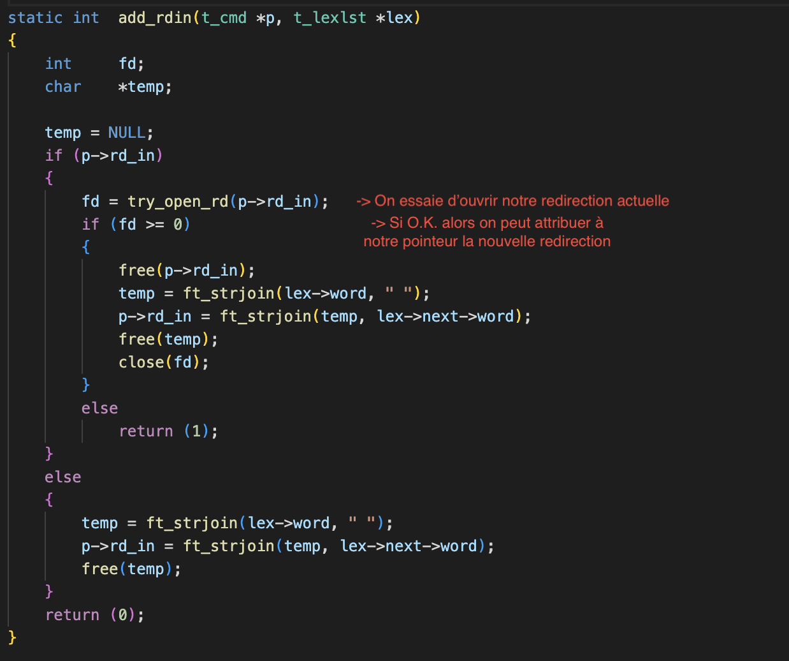

# LIMONSHELLO

:construction_worker_man: README en travaux ! :construction_worker_woman:

Une version simplifiée de Bash


## Principe
### Qu'est-ce qu'un shell ?

Un shell, ou interpréteur de commande, permet comme son nom l'indique la traduction de commandes saisies par un utilisateur à destination d'un système d'exploitation. Pour ce projet, nous essaierons de reproduire le comportement de bash, le shell Unix par défaut.
Le shell permet à l'utilisateur de lancer des programmes, effectuer des opérations de manipulation de fichiers, accéder aux répertoires et permet également d'afficher les résultats des commandes et d'interagir avec eux.

### Fonctionnalités
:construction_worker_man: :construction_worker_woman:
Liste des fonctionnalités implémentées.

### Achitecture générale
:construction_worker_man: :construction_worker_woman:
Loop, processus

## Parsing
Il faut tout d'abord délivrer à l'executeur des blocs d'instructions dans un format unique que nous définissons lors du parsing.
En suivant le fonctionnement interne de Bash, deux parties se dégagent :
### LEXER
Le rôle du lexer est tout simplement de séparer chaque "mot" les uns des autres. Un mot est défini comme une suite de caractères autres que séparateurs (espaces, tabulations...). Cependant, une string définie par des doubles ou simples guillements compte comme un seul mot, guillemets inclus. C'est donc à ce moment qu'on vérifiera que chaque quote est bien fermée.
Avant cela, fera un premier check de la place des pipes **"|"** et redirections **"<" ">" "<<" ">>"**, que plusieurs ne se suivent pas ou ne commencent/termine pas notre ligne de commande. Il faut penser à tous les cas de figure possibles.

On va donc récupérer chaque mots et les ajouter dans une liste chaînée.


Chaque élément de notre liste chaînée comporte donc un pointeur vers une string que nous avons alloué dynamiquement avec **malloc()**. La difficulté aura été ici de trouver la taille de chaque malloc, spécialement dans le cas de nos quotes.

### PARSER
:construction_worker_man: :construction_worker_woman:
Une fois notre liste chaînée délivrée par le lexer, il va falloir la convertir en une seconde liste chaînée propre au parser, où chaque élément contiendra une instruction à envoyer à l'executeur par après.
Pour faire simple, nous séparons notre liste lexer à chaque pipe **|** et classons chaque élément à l'interieur d'un groupe selon 3 catégories :
- La commande suivie de ses arguments. Sous forme de double pointeur char, la commande sera toujours  l'index 0.
- L'option builtin (à *NULL* par défaut) est un pointeur sur fonction. En plus de remplir le **char, si un de nos built-in est reconnu cette option permettra d'envoyer les arguments à l'une de nos fonctions.
- L'option redirection (à *NULL* par défaut). Cette string est composée du token de redirection, un espace et le nom de fichier spécifié.


> **Illustration trouvée sur le github de [Maia de Graaf](https://github.com/maiadegraaf)**


> **On trouve aussi un pointeur sur la liste chaînée contenant les variables d'environnement**


Après avoir malloc chaque nouvel élément de notre liste, nous entrons dans une boucle de tri jusqu'à rencontrer un pipe **|** ou la fin de notre première liste.
Ainsi, tant qu'un token de redirection n'est pas rencontré, nous récuperons chaque mot et le stockons dans le **char. Nous ne regardons pas si les commandes ou arguments sont valides, ce sera à la partie d'execution de le faire.


> **srcs/parser/parser.c**


Quand aux redirections, plusieurs problèmes se sont posés ici. En effet, et pour correspondre au comportement de bash, si l'utilisateur a entré plusieurs redirections en entrée comme en sortie, il faut:
- tester chaque input et renvoyer une erreur si un fichier n'existe pas ou si l'utilisateur n'a pas les droits
- tester chaque output, les créer si inexistants.

On aura donc une fonction qui testera d'ouvrir le file descriptor actuel si on cherche à lui attribuer une nouvelle string.
Ainsi, l'executor se retrouvera soit avec la dernière redirection du bloc, soit avec la dernière qui a posé une erreur. Ce sera à l'executor de réouvrir la redirection qu'on lui a envoyé, et de renvoyer une erreur s'il y en a une. En attendant, on aura testé chaque FD et crée les fichiers dans le cas des outputs:



> **srcs/parser/redirections.c**


### EXPANDER
A la fin de notre Parsing, nous envoyons les éléments de notre liste vers notre Expander. Le rôle de l'expander est de remplacer chaque variable d'environnement par sa valeur.
Par exemple la commande suivante devrait afficher votre nom d'utilisateur.
```bash
$> echo $USER
```
Cependant nous avons fait le choix d'octroyer à cette fonction la mission de supprimer les quotes, puisque ces deux actions sont étroitement liées. En effet, selon si les quotes sont doubles ou simples, les variables d'environnement ne seront pas interprétées.
On oubliera pas non plus la capacité de récupérer le dernier code d'erreur renvoyé par notre boucle :
```bash
$> echo $?
```

Aussi, si le pointeur builtin est different de NULL, alors nous n'enverrons pas nos commandes à l'expander. En effet dans certains cas certaines fonctionnalités comme **export** auront besoin des quotes. L'appel à l'expander se fera donc dans les built-ins mêmes.


## Executor
:construction_worker_man: :construction_worker_woman:


## Built-ins
:construction_worker_man: :construction_worker_woman:

## Problèmes rencontrés
:construction_worker_man: :construction_worker_woman:
Projet éternellement perfectible

## Documentation utilisée
:construction_worker_man: :construction_worker_woman: